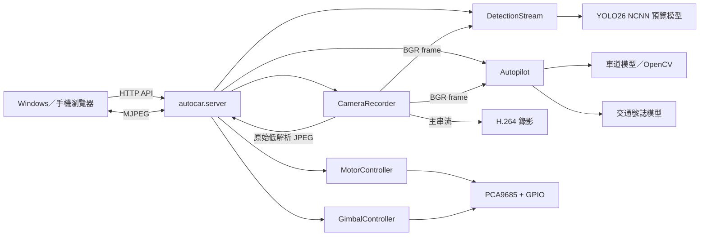

# Raspberry Pi 5 AutoCAR + YOLO26 從零實作教學手冊

> 2026-09-29：安裝器已支援任意既有非 root 帳號與 hostname。請先閱讀[通用安裝說明](PORTABLE_INSTALL_ZH_TW.md)；本文的 rpi5 帳號、家目錄及 IP 為原測試機範例，服務模板請由安裝器產生。

版本：2026-09-16  
本次板端正常操作與檔案驗證紀錄見 [部署備忘錄第 26 節](DEPLOYMENT_MEMO_ZH_TW.md#26-2026-09-16-板端更新與驗證紀錄)。  
適用平台：Raspberry Pi 5、64-bit Raspberry Pi OS、Python 3.13、Pi Camera／USB Webcam  
專案功能：網頁遙控、H.264 錄影、雲台、YOLO26 NCNN 預覽推論、車道循跡與交通號誌判斷

---

## 0. 閱讀方式與安全原則

本手冊按照實際部署順序編排。第一次實作時請從第 1 章依序進行，不要先啟動馬達再
處理相機或模型。

開始前遵守以下原則：

1. 車輪第一次測試時必須架空，避免方向接反造成衝撞。
2. Raspberry Pi 與馬達應使用足夠且穩定的電源；馬達突波可能使 Pi 重新開機。
3. 馬達電源與邏輯電源必須共地，但不要直接用 Pi 的 5V 腳位供應四顆馬達。
4. 測試自動駕駛前，先逐項完成手控、立即停止、watchdog、相機與模型測試。
5. 同一時間只允許一個程式控制相機；不要讓測試程式與正式服務同時執行。
6. NCNN 模型的匯出尺寸必須與執行設定完全相同。

指令提示符不需要輸入。例如：

```text
rpi5@rpi5:~ $
```

只代表該指令應在 Raspberry Pi 的終端執行。

---

## 1. 系統功能與整體架構

### 1.1 使用情境

系統提供兩種主要模式：

- 手動取景模式：關閉「視覺推論」，瀏覽器顯示原始畫面，可手控車體與錄製沒有偵測框
  的 H.264 素材，供後續資料標記及模型訓練。
- 自動駕駛模式：啟動視覺推論、車道偵測及交通號誌偵測，PID 依車道中心控制左右輪，
  紅燈或停止標誌會立即停車。

### 1.2 軟體資料流



### 1.3 為何只建立一個相機物件

`CameraRecorder` 只建立一個 Picamera2 實例，同時配置：

- `main`：1280 × 720 YUV420，供 BGR 擷取與 H.264 錄影。
- `lores`：640 × 360 YUV420，經 MJPEGEncoder 提供低負載原始預覽。

推論、錄影與網頁預覽都共享這個實例。如果分別建立多個 Picamera2，通常會出現
`Device or resource busy`。

### 1.4 專案目錄

```text
RPI5_AutoCAR/
├── autocar/
│   ├── server.py              HTTP、API、MJPEG 路由
│   ├── config.py              環境變數設定
│   ├── camera.py              相機共享、預覽與錄影
│   ├── detection_stream.py    YOLO26 預覽推論啟停
│   ├── motor.py               車體控制與 watchdog
│   ├── gimbal.py              雲台控制
│   ├── pca9685.py             PCA9685 暫存器控制
│   ├── perception.py          PID、車道與號誌辨識
│   └── autopilot.py           自動駕駛工作執行緒
├── web/                       車控網頁
├── deploy/                    systemd 與正式環境設定
├── scripts/                   安裝與獨立串流工具
├── training/                  訓練設定與程式
├── tests/                     單元測試
└── docs/                      開發與部署文件
```

---

## 2. 硬體準備

### 2.1 建議材料

- Raspberry Pi 5，建議 8 GB RAM。
- 32 GB 以上 microSD 或 NVMe。
- Raspberry Pi Camera（本專案已測 OV5647）或 USB Webcam。
- PCA9685 16 通道 PWM 板。
- 四輪底盤、四顆直流馬達及相容馬達驅動電路。
- 兩顆伺服馬達雲台。
- Raspberry Pi 5 官方 27 W 電源或品質相當的穩定電源。
- 馬達獨立電源、共同接地線、主動式散熱器。

### 2.2 I²C 與 PCA9685

PCA9685 基本連線：

| Raspberry Pi 5 | PCA9685 | 用途 |
|---|---|---|
| 3.3V | VCC | 邏輯電源 |
| GND | GND | 共地 |
| GPIO2 / SDA | SDA | I²C 資料 |
| GPIO3 / SCL | SCL | I²C 時脈 |

伺服電源應依模組規格接到 PCA9685 的伺服電源端，不要讓兩顆伺服的瞬時電流直接經過
Pi 的 3.3V 腳位。

### 2.3 本專案通道配置

| 裝置 | PWM／方向通道 |
|---|---|
| 馬達 A（左側） | PWM 0、方向 2/1 |
| 馬達 B（右側） | PWM 5、方向 3/4 |
| 馬達 C（左側） | PWM 6、方向 8/7 |
| 馬達 D（右側） | PWM 11、方向 BCM25/24 |
| 雲台水平 Pan | PCA9685 12 |
| 雲台俯仰 Tilt | PCA9685 13 |

實際馬達正反方向若與車體不同，應調整接線或程式方向，不要直接提高 PWM 嘗試修正。

---

## 3. 安裝 Raspberry Pi OS

### 3.1 寫入系統

在 Windows 安裝 Raspberry Pi Imager，選擇 64-bit Raspberry Pi OS。寫入前設定：

- Hostname：`rpi5`
- 使用者：`rpi5`
- 設定安全密碼
- 設定 Wi-Fi SSID、密碼及國家
- 啟用 SSH
- 時區：`Asia/Taipei`

### 3.2 第一次登入

在 Windows PowerShell：

```powershell
ssh rpi5@<Pi-IP>
```

例如：

```powershell
ssh rpi5@192.168.0.160
```

若不知道 IP，可在 Pi 執行：

```bash
hostname -I
```

### 3.3 更新系統

```bash
sudo apt update
sudo apt full-upgrade -y
sudo reboot
```

重新開機後再次 SSH 登入。

---

## 4. 啟用硬體介面與基礎檢查

### 4.1 啟用 I²C

```bash
sudo raspi-config
```

依序選擇 `Interface Options` → `I2C` → `Enable`，然後重新開機：

```bash
sudo reboot
```

### 4.2 確認 PCA9685

```bash
sudo apt install -y i2c-tools
sudo i2cdetect -y 1
```

表格中應出現 `40`。若沒有：

1. 關閉電源。
2. 檢查 SDA、SCL、VCC、GND。
3. 確認模組地址跳線沒有改變。
4. 再開機檢查。

### 4.3 確認相機

```bash
sudo apt install -y v4l-utils
rpicam-hello --list-cameras
```

拍攝單張圖片：

```bash
rpicam-still -o ~/camera-test.jpg
ls -lh ~/camera-test.jpg
```

SSH 終端不要執行 `cv2.imshow()`；沒有桌面顯示時會出現 Qt `xcb` 錯誤。

---

## 5. 將專案傳到 Pi

Windows 主機保留的唯一完整壓縮檔為：

```text
RPI5_AutoCAR-YOLO-integrated.zip
```

在 Windows PowerShell 上傳：

```powershell
scp "C:\Users\TTU_SE\Documents\ChatGPT\RPI5_AutoCAR\RPI5_AutoCAR-YOLO-integrated.zip" `
  rpi5@<Pi-IP>:/home/rpi5/
```

在 Pi 解壓縮：

```bash
sudo apt install -y unzip
mkdir -p ~/RPI5_AutoCAR
unzip -o ~/RPI5_AutoCAR-YOLO-integrated.zip -d ~/RPI5_AutoCAR
cd ~/RPI5_AutoCAR
```

確認：

```bash
find . -maxdepth 2 -type f | sort
```

---

## 6. 理解正式安裝架構

本專案使用兩個不同位置：

- `~/RPI5_AutoCAR`：上傳、閱讀及修改的來源目錄。
- `/opt/autocar`：systemd 正式執行的程式目錄。
- `/opt/autocar-venv`：正式 Python 虛擬環境。
- `/etc/autocar.env`：硬體、模型及控制參數。
- `/home/rpi5/Videos/autocar`：錄影輸出。

這表示只修改家目錄中的程式不會自動影響服務；修改後必須重新執行安裝腳本或明確複製
到 `/opt/autocar`。

---

## 7. 執行自動安裝

### 7.1 安裝腳本做了什麼

`scripts/install_pi.sh` 會：

1. 安裝 Picamera2、gpiozero、OpenCV、NumPy、I²C 等 Raspberry Pi OS 套件。
2. 建立 `/opt/autocar` 與錄影目錄。
3. 複製後端及網頁程式。
4. 建立具有 system site packages 的正式虛擬環境，以便使用 apt 的 Picamera2。
5. 安裝 NumPy、SciPy、CPU PyTorch、Ultralytics 與 NCNN。
6. 聯合載入 AI 套件；若第一次失敗則重裝一次再驗證。
7. 安裝並啟動 `autocar.service`。

### 7.2 執行

```bash
cd ~/RPI5_AutoCAR
chmod +x scripts/install_pi.sh
sudo ./scripts/install_pi.sh
```

安裝 PyTorch 時可能需要數分鐘，不要中途中斷電源。

### 7.3 驗證正式 Python 環境

```bash
/opt/autocar-venv/bin/python - <<'PY'
import cv2
import numpy
import torch
import torchvision
import ultralytics
import ncnn
from picamera2 import Picamera2

print("NumPy:", numpy.__version__, numpy.__file__)
print("OpenCV:", cv2.__version__)
print("PyTorch:", torch.__version__)
print("Torchvision:", torchvision.__version__)
print("Ultralytics:", ultralytics.__version__)
print("NCNN:", ncnn.__file__)
print("Picamera2: READY")
print("AI runtime: READY")
PY
```

Pi 5 沒有 NVIDIA CUDA，因此 `torch.cuda.is_available()` 為 `False` 是正常的。

---

## 8. 建立與部署 YOLO26 NCNN 預覽模型

### 8.1 先測試 `.pt`

在開發環境：

```bash
cd ~/RPI5_AutoCAR
python3 -m venv --system-site-packages .venv
source .venv/bin/activate
python -m pip install --upgrade pip
python -m pip install ultralytics ncnn

wget -O bus.jpg https://ultralytics.com/images/bus.jpg
yolo predict model=yolo26n.pt source=bus.jpg device=cpu
```

### 8.2 匯出 640 × 640 NCNN

```bash
yolo export \
  model=yolo26n.pt \
  format=ncnn \
  imgsz=640 \
  batch=1 \
  device=cpu
```

模型目錄至少應有：

```text
yolo26n_ncnn_model/
├── metadata.yaml
├── model.ncnn.param
└── model.ncnn.bin
```

### 8.3 先做單張推論

```bash
yolo predict \
  model=yolo26n_ncnn_model \
  source=bus.jpg \
  imgsz=640
```

### 8.4 部署至正式目錄

```bash
sudo systemctl stop autocar.service
sudo mkdir -p /opt/autocar/models
sudo cp -a ~/RPI5_AutoCAR/yolo26n_ncnn_model /opt/autocar/models/
sudo chown -R rpi5:rpi5 /opt/autocar/models
```

### 8.5 固定尺寸規則

```ini
AUTOCAR_PREVIEW_MODEL=models/yolo26n_ncnn_model
AUTOCAR_PREVIEW_IMGSZ=640
```

兩者必須匹配。要改成 320 時，必須重新匯出：

```bash
cp yolo26n.pt yolo26n_320.pt
yolo export model=yolo26n_320.pt format=ncnn imgsz=320 batch=1 device=cpu
```

然後成對修改：

```ini
AUTOCAR_PREVIEW_MODEL=models/yolo26n_320_ncnn_model
AUTOCAR_PREVIEW_IMGSZ=320
```

128 雖然更快，但遠方號誌與小物件容易漏檢，建議先測 320。

程式啟動推論前會讀取 `metadata.yaml` 並和 `AUTOCAR_PREVIEW_IMGSZ` 比較。尺寸不一致時
回傳 `NCNN input mismatch`，維持原始畫面。2026-09-10 實機最終驗證成功的組合是
`models/yolo26n_ncnn_model + 640`；不可把 `models/yolo26n_320_ncnn_model` 配成 640。

### 從網頁隨時切換 640／320

1. 確認 640 與 320 的完整 NCNN 模型目錄都已放入 `/opt/autocar/models/`。
2. 開啟車控網頁，先關閉「自動駕駛」，再關閉「視覺推論」。
3. 在「推論模型與固定尺寸」選擇 `yolo26n_320_ncnn_model (320×320)`。
4. 按「套用」，再重新開啟「視覺推論」。標題會顯示目前使用的尺寸。
5. 要回到 640 時，重複上述步驟並選擇 640 模型。

網頁會讀取模型的 `metadata.yaml` 形成安全配對。切換只對本次服務有效；若要把 320 設為
每次開機的預設值，執行：

```bash
sudo sed -i 's|^AUTOCAR_PREVIEW_MODEL=.*|AUTOCAR_PREVIEW_MODEL=models/yolo26n_320_ncnn_model|' /etc/autocar.env
sudo sed -i 's|^AUTOCAR_PREVIEW_IMGSZ=.*|AUTOCAR_PREVIEW_IMGSZ=320|' /etc/autocar.env
sudo systemctl restart autocar.service
```

> Pi 5 注意：程式會在相機初始化之前預先載入 PyTorch、NCNN 與 Ultralytics。請勿移除
> `server.py` 中的 `DETECTION.preload_runtime()`；否則瀏覽器先開啟相機後再啟動推論，
> 可能出現 `libtorch_cpu.so: undefined symbol: sbgemm_`。

---

## 9. 設定 `/etc/autocar.env`

編輯：

```bash
sudo nano /etc/autocar.env
```

完整基準設定：

```ini
AUTOCAR_HOST=0.0.0.0
AUTOCAR_PORT=8000
AUTOCAR_GPIO=pca9685
AUTOCAR_WATCHDOG_SECONDS=0.8
AUTOCAR_MANUAL_SPEED=50
AUTOCAR_DIRECTION_CHANGE_DELAY=0.15
AUTOCAR_RECORDINGS=/home/rpi5/Videos/autocar

AUTOCAR_CAMERA_INDEX=0
AUTOCAR_CAMERA_ROTATE_180=1

AUTOCAR_PREVIEW_MODEL=models/yolo26n_ncnn_model
AUTOCAR_PREVIEW_IMGSZ=640
AUTOCAR_PREVIEW_CONFIDENCE=0.40
AUTOCAR_PREVIEW_MAX_DET=20
AUTOCAR_PREVIEW_JPEG_QUALITY=65

AUTOCAR_GIMBAL=pca9685
AUTOCAR_GIMBAL_STEP=10
AUTOCAR_PAN_MIN=-80
AUTOCAR_PAN_MAX=80
AUTOCAR_TILT_MIN=-80
AUTOCAR_TILT_MAX=80
AUTOCAR_PAN_CENTER=0
AUTOCAR_TILT_CENTER=-80
AUTOCAR_PAN_INVERT=0
AUTOCAR_TILT_INVERT=1
AUTOCAR_TILT_LOGICAL_MIN=-40
AUTOCAR_TILT_LOGICAL_MAX=10
AUTOCAR_I2C_BUS=1
AUTOCAR_PCA9685_ADDRESS=0x40
AUTOCAR_PAN_CHANNEL=12
AUTOCAR_TILT_CHANNEL=13

AUTOCAR_MODEL=models/traffic_best_ncnn_model
AUTOCAR_LANE_MODEL=models/lane_best_ncnn_model
AUTOCAR_LANE_BACKEND=auto
AUTOCAR_INFERENCE_IMGSZ=416
AUTOCAR_TRAFFIC_CONFIDENCE=0.45
AUTOCAR_TRAFFIC_HISTORY=5
AUTOCAR_TRAFFIC_VOTES=3
AUTOCAR_TRAFFIC_REQUIRED=1
AUTOCAR_LANE_REQUIRED=1
AUTOCAR_LANE_ROI_START=0.55
AUTOCAR_LANE_CLASS=lane
AUTOCAR_AUTO_SPEED=0.42
AUTOCAR_AUTO_SLOW_SPEED=0.22
AUTOCAR_LANE_KP=0.0030
AUTOCAR_LANE_KI=0.00002
AUTOCAR_LANE_KD=0.0010
AUTOCAR_LANE_MIN_CONFIDENCE=0.3
AUTOCAR_TRAFFIC_STALE_SECONDS=1.0
```

同一個變數不要重複出現。修改後執行：

```bash
sudo systemctl restart autocar.service
```

---

## 10. 相機與錄影程式架構

### 10.1 相機配置核心

`autocar/camera.py` 的核心概念：

```python
config = camera.create_video_configuration(
    main={"size": (1280, 720), "format": "YUV420"},
    lores={"size": (640, 360), "format": "YUV420"},
    encode="main",
    buffer_count=6,
    transform=Transform(hflip=rotate_180, vflip=rotate_180),
)
```

原始網頁預覽使用 `lores` MJPEG；錄影使用 `main` H.264。即使視覺推論開啟，H.264
檔案仍是原始畫面，不會把網頁上的框線燒錄進影片。

### 10.2 上下顛倒

Pi Camera 倒裝：

```ini
AUTOCAR_CAMERA_ROTATE_180=1
```

正常方向或外接 Webcam：

```ini
AUTOCAR_CAMERA_ROTATE_180=0
```

### 10.3 外接 Webcam

列出相機：

```bash
rpicam-hello --list-cameras
v4l2-ctl --list-devices
```

若 USB Webcam 是索引 1：

```ini
AUTOCAR_CAMERA_INDEX=1
AUTOCAR_CAMERA_ROTATE_180=0
```

變更前停止其他相機程式，再重啟服務。

---

## 11. 車體控制程式架構

### 11.1 手控流程

啟用車體後四輪以預設 PWM 前進。F/B 每次加減 5%，L/R 每次調整 5° 差速轉向設定；
放開維持設定。瀏覽器每 200 ms 傳送 `/api/vehicle/heartbeat`，不重送累加指令。
STOP／空白鍵停止並歸零，切換視窗或隱藏頁面也會送 STOP。UI 顯示設定值及各輪 PWM，
沒有輪速／角度感測器，因此不代表實測 RPM 或車頭角度。
如果瀏覽器失聯，後端 watchdog 在預設 0.8 秒後停止馬達。

核心安全判斷：

```python
if direction != "stop" and not self._enabled:
    raise RuntimeError("vehicle is disabled")

if self._direction != "stop" and timeout_exceeded:
    self._apply("stop")
```

### 11.2 換向保護

手動 B 僅減速、不倒車；自動模式左右輪命令若切換正反方向，程式先把 PWM 歸零，等待
`AUTOCAR_DIRECTION_CHANGE_DELAY=0.15` 秒，再送出反向命令。這可降低電流突波與 Pi 重啟
機率。

### 11.3 第一次架空測試

啟動服務後，在瀏覽器：

1. 打開「車體控制」，確認四輪同速前進。
2. 短按 F，確認加速。
3. 短按 B，確認減速，最低 0% 不倒車。
4. 連按 L/R，確認逐步差速轉向；放開後維持設定。
5. 按 STOP，確認四輪停止與設定歸零。
6. 再用 F 起步後中斷連線，確認 watchdog 約 0.8 秒後自動停止。

任何輪子方向相反都應先修正，不可進入地面測試。

---

## 12. 雲台控制程式架構

邏輯角度與實體角度分離：

```python
physical_pan = pan_center + (-pan if pan_invert else pan)
physical_tilt = tilt_center + (-tilt if tilt_invert else tilt)
```

首次校正：

1. 架空或拆下連桿，避免伺服撞到機構極限。
2. 按「置中」。
3. 調整 `AUTOCAR_PAN_CENTER` 與 `AUTOCAR_TILT_CENTER`。
4. 方向相反時修改 `PAN_INVERT` 或 `TILT_INVERT`。
5. 用邏輯上下限限制可動範圍。

每次修改後：

```bash
sudo systemctl restart autocar.service
sudo journalctl -u autocar.service -n 50 --no-pager
```

---

## 13. 視覺推論啟停與串流

### 13.1 關閉推論

預設狀態為關閉：

- 不載入 YOLO26。
- `/api/camera/stream` 直接提供原始 MJPEG。
- 手控、雲台、H.264 錄影正常。
- 適合蒐集標記資料。

### 13.2 開啟推論

後端依序載入 OpenCV、NumPy、PyTorch、Ultralytics，最後才載入 NCNN，預檢成功才啟動工作
執行緒。推論循環：

```python
frame = camera.capture_bgr()
result = model.predict(frame, imgsz=640, conf=0.40, max_det=20)[0]
annotated = result.plot()
```

若預檢失敗，API 回傳錯誤，網頁開關復原為關閉並保留原始畫面。

若模型載入或推論循環開始後才發生錯誤，後端會自動將推論設為關閉；網頁狀態輪詢偵測
到變化後會重新連接相機串流，改顯示原始 MJPEG。這項降級設計可確保 AI 故障時仍能
手控取景與錄影，同時在辨識欄保留錯誤原因。

順序中的 NCNN 必須放在 PyTorch 之後。若先 `import ncnn` 再 `import torch`，兩套原生
運算函式庫可能發生 BLAS 符號衝突，造成 `libtorch_cpu.so: undefined symbol: sbgemm_`。

### 13.3 API

```bash
curl -X POST http://127.0.0.1:8000/api/detection/enable \
  -H 'Content-Type: application/json' \
  -d '{"enabled":true}'
```

關閉：

```bash
curl -X POST http://127.0.0.1:8000/api/detection/enable \
  -H 'Content-Type: application/json' \
  -d '{"enabled":false}'
```

自動駕駛運行時不可單獨關閉推論，必須先停止自動駕駛。

---

## 14. 網頁與後端 API

### 14.1 正式入口

```text
http://<Pi-IP>:8000
```

### 14.2 API 一覽

| 方法 | 路徑 | 功能 |
|---|---|---|
| GET | `/api/status` | 所有狀態與錯誤 |
| GET | `/api/camera/stream` | 原始／畫框 MJPEG |
| POST | `/api/vehicle/enable` | 車體啟停 |
| POST | `/api/vehicle/drive` | forward/backward/left/right/stop |
| POST | `/api/camera/start` | 開始 H.264 錄影 |
| POST | `/api/camera/stop` | 停止錄影 |
| POST | `/api/detection/enable` | 視覺推論啟停 |
| POST | `/api/autopilot/enable` | 自動駕駛啟停 |
| POST | `/api/gimbal/move` | 雲台移動 |
| POST | `/api/gimbal/center` | 雲台置中 |

### 14.3 手動 API 測試

```bash
curl http://127.0.0.1:8000/api/status

curl -X POST http://127.0.0.1:8000/api/vehicle/enable \
  -H 'Content-Type: application/json' -d '{"enabled":true}'

curl -X POST http://127.0.0.1:8000/api/vehicle/drive \
  -H 'Content-Type: application/json' -d '{"direction":"stop"}'
```

安全起見，指令測試先使用 `stop`，方向控制應在車輪架空時從網頁測試。

---

## 15. 訓練交通號誌模型

### 15.1 類別

建議使用：

```text
red_light
yellow_light
green_light
stop_sign
```

### 15.2 資料目錄

```text
datasets/traffic/
├── images/train
├── images/val
├── labels/train
└── labels/val
```

每張影像有對應 YOLO 標記文字檔。建議在具 NVIDIA GPU 的電腦訓練，不要在 Pi 上做
完整訓練。

### 15.3 訓練

```bash
python training/train_traffic.py
```

等效核心程式：

```python
from ultralytics import YOLO

model = YOLO("yolo26n.pt")
model.train(
    data="training/traffic_light.yaml",
    epochs=60,
    imgsz=416,
    batch=16,
    device=0,
)
model.export(format="ncnn", imgsz=416, batch=1)
```

將輸出完整目錄命名為 `traffic_best_ncnn_model` 並複製到 `/opt/autocar/models`。

```bash
sudo cp -a traffic_best_ncnn_model /opt/autocar/models/
sudo chown -R rpi5:rpi5 /opt/autocar/models/traffic_best_ncnn_model
```

---

## 16. 訓練車道分割模型

車道使用 segmentation，不是一般 bounding box detection。資料類別名稱必須與：

```ini
AUTOCAR_LANE_CLASS=lane
```

一致。訓練：

```bash
python training/train_lane.py
```

核心程式：

```python
from ultralytics import YOLO

model = YOLO("yolo26n-seg.pt")
model.train(
    data="training/lane_seg.yaml",
    epochs=80,
    imgsz=416,
    batch=8,
    device=0,
)
model.export(format="ncnn", imgsz=416, batch=1)
```

部署為：

```text
/opt/autocar/models/lane_best_ncnn_model
```

```bash
sudo cp -a lane_best_ncnn_model /opt/autocar/models/
sudo chown -R rpi5:rpi5 /opt/autocar/models/lane_best_ncnn_model
```

若尚未準備車道模型，可在純功能測試階段使用：

```ini
AUTOCAR_LANE_BACKEND=opencv
AUTOCAR_LANE_REQUIRED=0
AUTOCAR_TRAFFIC_REQUIRED=0
```

正式自動駕駛前應恢復必要模型要求。

---

## 17. 自動駕駛演算法

### 17.1 車道誤差

車道模型或 OpenCV 找出車道中心後：

```text
error = lane_center - frame_center
```

負值代表車道中心偏左，正值代表偏右。

### 17.2 PID

```text
steering = Kp × error + Ki × integral(error) + Kd × derivative(error)
left  = base_speed + steering
right = base_speed - steering
```

程式包含 integral anti-windup，並把轉向輸出限制在安全範圍。

初始值：

```ini
AUTOCAR_LANE_KP=0.0030
AUTOCAR_LANE_KI=0.00002
AUTOCAR_LANE_KD=0.0010
```

調整順序：

1. 先把車速設低。
2. `Ki=0`、`Kd=0`，增加 Kp 到能轉向但不劇烈震盪。
3. 增加 Kd 抑制左右擺動。
4. 最後才加入很小的 Ki 修正長期偏差。

### 17.3 號誌安全邏輯

- `RED` 或 `STOP_SIGN`：單幀成立立即停車。
- `YELLOW`：降低速度。
- `GREEN`：需符合 5 幀中至少 3 幀的穩定投票。
- 結果超過 `AUTOCAR_TRAFFIC_STALE_SECONDS`：必要模型模式下停車。
- 車道信心低於門檻：停車。

---

## 18. systemd 正式服務

### 18.1 服務內容

```ini
[Service]
User=rpi5
Group=rpi5
WorkingDirectory=/opt/autocar
EnvironmentFile=-/etc/autocar.env
ExecStart=/opt/autocar-venv/bin/python -m autocar.server
Restart=on-failure
RestartSec=2
KillSignal=SIGINT
```

### 18.2 常用指令

```bash
sudo systemctl start autocar.service
sudo systemctl stop autocar.service
sudo systemctl restart autocar.service
systemctl status autocar.service --no-pager
sudo journalctl -u autocar.service -f
```

取消開機啟動：

```bash
sudo systemctl disable --now autocar.service
```

恢復開機啟動：

```bash
sudo systemctl enable --now autocar.service
```

服務啟動時，不要同時執行 `camera_test.py`、`yolo_web_stream.py` 或 `rpicam-hello`。

---

## 19. 完整驗收順序

### 19.1 靜態與單元測試

在專案來源目錄：

```bash
python -m compileall -q autocar scripts tests
python -m unittest discover -s tests -v
bash -n scripts/install_pi.sh
```

### 19.2 板端驗收

依序完成：

1. `i2cdetect` 顯示 `0x40`。
2. 相機可拍單張照片。
3. AI runtime 聯合載入成功。
4. NCNN 單張推論成功。
5. 服務為 `active (running)`。
6. Windows 可開啟網頁。
7. 推論關閉時有原始畫面。
8. 手控與 STOP 正常。
9. watchdog 可自動停車。
10. 錄影檔建立且可播放。
11. 雲台方向及限制正常。
12. 開啟推論後有框線及 FPS。
13. 關閉推論後恢復原始畫面。
14. 最後才以低速測試自動駕駛。

### 19.3 狀態快照

```bash
curl -s http://127.0.0.1:8000/api/status
systemctl status autocar.service --no-pager
sudo journalctl -u autocar.service -n 100 --no-pager
```

---

## 20. 效能、供電與散熱

### 20.1 解析度參考

| 尺寸 | Pi 5 原始推論參考 | 建議 |
|---:|---:|---|
| 640 | 約 12–15 FPS | 精度優先、目前預設 |
| 416 | 約 18–28 FPS | 折衷 |
| 320 | 約 25–40 FPS | 建議效能版 |
| 256 | 約 35–55 FPS | 近距離大物件 |
| 128 | 可能超過 60 FPS | 只作實驗 |

網頁 FPS 還包含擷取、畫框及 JPEG 編碼，因此低於純推論 FPS 是正常的。

### 20.2 監控

```bash
watch -n 2 'vcgencmd measure_temp; vcgencmd get_throttled; free -h; ps -C python -o pid,%cpu,%mem,rss,etime,cmd'
```

`get_throttled=0x0` 表示目前及歷史上未偵測到低電壓或節流旗標。

### 20.3 當機後

```bash
sudo journalctl -k -b -1 --no-pager | tail -n 200
sudo journalctl -u autocar.service -b -1 --no-pager | tail -n 200
```

完全失聯或重新開機通常先查電源、馬達突波、溫度、OOM 與儲存裝置；只有服務退出但
SSH 正常時，才優先查 Python、NCNN 或模型錯誤。

---

## 21. 常見故障與修復

### 21.1 `Device or resource busy`

```bash
sudo systemctl stop autocar.service
sudo fuser -v /dev/video* /dev/media*
```

停止另一份相機程式後再啟動服務。

### 21.2 `No module named 'ncnn'`

```bash
sudo systemctl stop autocar.service
sudo /opt/autocar-venv/bin/python -m pip install --upgrade --no-cache-dir ncnn
/opt/autocar-venv/bin/python -c "import ncnn; print(ncnn.__file__)"
sudo systemctl start autocar.service
```

### 21.3 `libtorch_cpu.so: undefined symbol: sbgemm_`

```bash
sudo systemctl stop autocar.service

sudo /opt/autocar-venv/bin/python -m pip install \
  --upgrade --force-reinstall --no-cache-dir numpy scipy

sudo /opt/autocar-venv/bin/python -m pip install \
  --upgrade --force-reinstall --no-cache-dir \
  torch torchvision \
  --index-url https://download.pytorch.org/whl/cpu
```

重新執行第 7.3 節的聯合載入測試，成功後才啟動服務。

本專案實機曾出現相同文字，但 `torch+cpu`、OpenCV/NumPy/PyTorch、完整 runtime、
Picamera2 加完整 runtime，以及 640 NCNN 單張推論全部成功。最後確認服務曾把 320 模型
目錄配成 `AUTOCAR_PREVIEW_IMGSZ=640`。修正為 640 模型配 640 後恢復正常。因此排查時
必須同時驗證套件載入、單張模型推論及模型／尺寸配對，不應只重裝 PyTorch。

### 21.4 `[Errno 28] No space left on device` 與 CUDA 誤下載

若 CPU PyTorch 安裝後又執行：

```bash
pip install --force-reinstall ultralytics ncnn
```

pip 可能從一般 PyPI 重裝非 CPU 版 PyTorch，並下載 CUDA Toolkit、cuDNN、cuBLAS、NCCL、
Triton 等數 GB 套件。Pi 5 不需要這些套件；看到下載 `cuda-*`、`nvidia-*` 或 `triton`
時應立即中止。

停止服務並清理可能已安裝的套件：

```bash
sudo systemctl stop autocar.service

sudo /opt/autocar-venv/bin/python -m pip uninstall -y \
  cuda-toolkit cuda-bindings cuda-pathfinder \
  nvidia-cudnn-cu13 nvidia-cusparselt-cu13 \
  nvidia-nccl-cu13 nvidia-nvshmem-cu13 nvidia-cublas \
  nvidia-cuda-nvrtc nvidia-cuda-runtime nvidia-cufft \
  nvidia-nvjitlink nvidia-cufile nvidia-cuda-cupti \
  nvidia-curand nvidia-cusolver nvidia-cusparse nvidia-nvtx \
  triton

sudo /opt/autocar-venv/bin/python -m pip cache purge
python3 -m pip cache purge
sudo apt clean
df -h /
```

顯示某些套件未安裝是正常的。根目錄建議至少空出 2 GiB。確認 CPU PyTorch 後，用
`--no-deps` 修復 Ultralytics，避免它再次更換 torch：

```bash
/opt/autocar-venv/bin/python -c \
  "import torch; print(torch.__version__, torch.cuda.is_available())"

sudo /opt/autocar-venv/bin/python -m pip install \
  --upgrade --no-cache-dir --no-deps ultralytics

sudo /opt/autocar-venv/bin/python -m pip install \
  --upgrade --no-cache-dir ncnn
```

正確結果應包含 `+cpu` 與 `False`。再執行第 7.3 節聯合載入測試，成功後才啟動服務。

### 21.5 網頁有畫面但推論 0 FPS

```bash
sudo journalctl -u autocar.service -n 200 --no-pager
grep -E '^AUTOCAR_PREVIEW_' /etc/autocar.env
find /opt/autocar/models/yolo26n_ncnn_model -maxdepth 1 -type f
```

確認模型存在、服務帳號可讀、尺寸相同且 `ncnn` 可載入。

### 21.6 自動駕駛顯示模型不存在

預覽模型、交通模型及車道模型是三個設定：

```ini
AUTOCAR_PREVIEW_MODEL=models/yolo26n_ncnn_model
AUTOCAR_MODEL=models/traffic_best_ncnn_model
AUTOCAR_LANE_MODEL=models/lane_best_ncnn_model
```

預覽正常不代表自動駕駛模型已部署。

### 21.7 SSH 主機金鑰變更

先在 Pi 本機確認：

```bash
sudo ssh-keygen -lf /etc/ssh/ssh_host_ed25519_key.pub
```

只有確認指紋可信後，才在 Windows 移除舊紀錄：

```powershell
ssh-keygen -R <Pi-IP>
ssh rpi5@<Pi-IP>
```

---

## 22. 更新、備份與回復

### 22.1 更新前備份

```bash
sudo systemctl stop autocar.service
sudo cp -a /opt/autocar /opt/autocar.backup
sudo cp -a /etc/autocar.env /etc/autocar.env.backup
```

### 22.2 安裝新版

```bash
cd ~/RPI5_AutoCAR
sudo ./scripts/install_pi.sh
```

安裝腳本保留既有 `/etc/autocar.env`，也不會刪除 `/opt/autocar/models`。

### 22.3 回復

```bash
sudo systemctl stop autocar.service
sudo cp -a /opt/autocar.backup/. /opt/autocar/
sudo cp -a /etc/autocar.env.backup /etc/autocar.env
sudo systemctl start autocar.service
```

---

## 23. 最終操作流程

### 23.1 手控訓練取景

1. 開啟 `http://<Pi-IP>:8000`。
2. 確認視覺推論為關閉。
3. 啟用車體控制。
4. 開始錄影。
5. 使用方向鍵或 WASD 行駛。
6. 停車後停止錄影。
7. 從 `/home/rpi5/Videos/autocar` 取回 `.h264`。

Windows 下載：

```powershell
scp "rpi5@<Pi-IP>:/home/rpi5/Videos/autocar/*.h264" .
```

### 23.2 自動駕駛

1. 確認三個模型及其固定尺寸。
2. 架空車輪並確認 STOP、watchdog。
3. 開啟網頁。
4. 啟動自動駕駛；視覺推論會自動開啟。
5. 確認車道信心、轉向值、號誌與 FPS。
6. 先在封閉場地以低速測試。
7. 發生異常立即關閉自動駕駛或按 STOP。

---

## 24. 完成標準

專案可視為完成部署，需同時符合：

- 車體、相機、雲台、推論與自動駕駛都由同一個 systemd 服務管理。
- 瀏覽器斷線時 watchdog 會停車。
- 推論關閉時可穩定手控、原始預覽及錄影。
- 推論損壞時不影響原始預覽與手控取景。
- 模型與執行尺寸完全匹配。
- 交通號誌與車道模型均經實際場景驗證。
- Pi 沒有低電壓、熱節流、OOM 或重複相機程序。
- 重開機後服務自動恢復，且日誌無持續錯誤。

更多故障案例與效能測試可搭配閱讀
[`DEPLOYMENT_MEMO_ZH_TW.md`](DEPLOYMENT_MEMO_ZH_TW.md)；演算法細節可閱讀
[`DEVELOPER_GUIDE.md`](DEVELOPER_GUIDE.md)。
